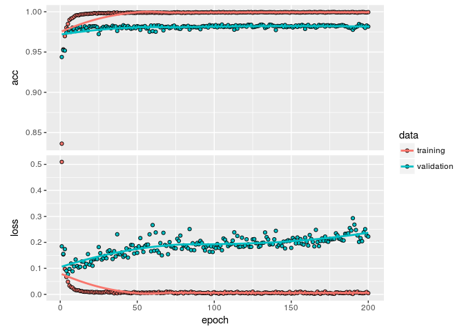
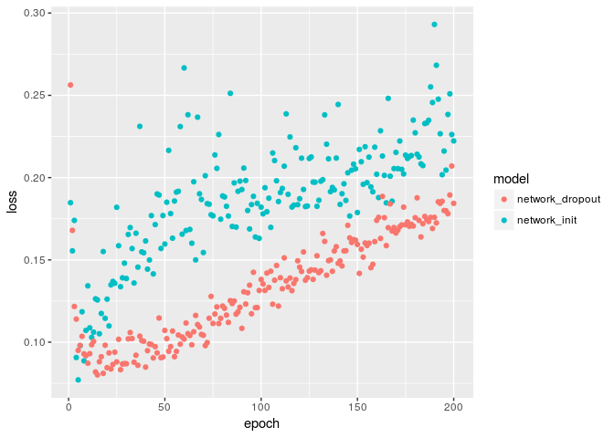
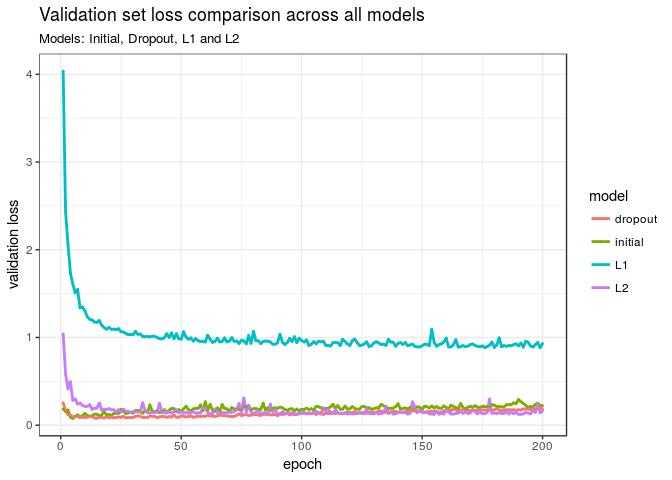
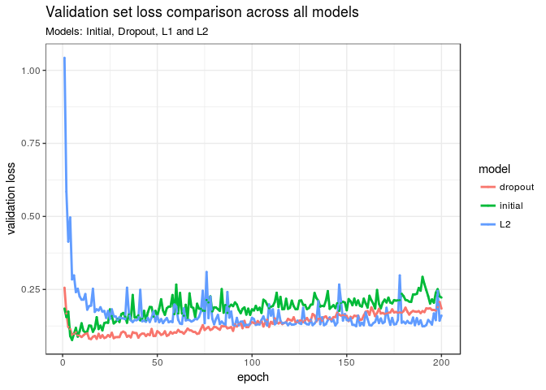

PS3\_Part1
================
Nora Nickels
5/16/2018

Problem Set 3
=============

Part 1: Image Classification
----------------------------

### Set Seed and Load the MNIST Dataset

-   Load the MNIST dataset
-   Preprocess the data by converting the data to a 2D tensor with individual values between 0 and 1
-   Randomly split the training data into 50,000 training observations and 10,000 validation observations

``` r
library(keras)
library(keras)
# install_keras(tensorflow = "gpu")
library(modelr)
library(tidyverse)
```

    ## ── Attaching packages ─────────────────────────────────────────────── tidyverse 1.2.1 ──

    ## ✔ ggplot2 2.2.1     ✔ purrr   0.2.4
    ## ✔ tibble  1.4.2     ✔ dplyr   0.7.4
    ## ✔ tidyr   0.7.2     ✔ stringr 1.2.0
    ## ✔ readr   1.1.1     ✔ forcats 0.2.0

    ## ── Conflicts ────────────────────────────────────────────────── tidyverse_conflicts() ──
    ## ✖ dplyr::filter() masks stats::filter()
    ## ✖ dplyr::lag()    masks stats::lag()

``` r
library(ggplot2)

set.seed(1234)

# Load the MNIST dataset

mnist <- dataset_mnist()

# Preprocess the data by converting the data to a 2D tensor with individual values between 0 and 1
# Randomly split the training data into 50,000 training observations and 10,000 validation observations

train_images <- array_reshape(mnist$train$x, c(60000, 28 * 28))
train_images <- train_images / 255

test_images <- array_reshape( mnist$test$x, c(10000, 28 * 28))
test_images <- test_images / 255

train_labels <- to_categorical(mnist$train$y)
test_labels <- to_categorical(mnist$test$y)

# Split train and validation data
split_train <- resample_partition(data.frame(train_images), 
                            c(test = 0.16667, train = 1- 0.16667))

x_val <- train_images[split_train$test$idx,]
partial_x_train <- train_images[split_train$train$idx,]

y_val <- train_labels[split_train$test$idx,]
partial_y_train <- train_labels[split_train$train$idx,]
```

### Implement a series of neural network models

-   Implement a series of neural network models
-   Initial test
-   5 dense, fully-connected layers
-   relu activation except for the last layer (use softmax)
-   Initialize with 512 hidden units apiece (except for the last layer)
-   Use rmsprop optimizer
-   Use categorical crossentropy for loss function
-   Track validation set accuracy during training process
-   Train with batch\_size = 512 and 200 epochs
-   Plot the validation set accuracy and loss over the epochs
-   Identify the epoch where the model's performance degrades based on the validation set

``` r
# 5 dense, fully-connected layers
# relu activation except for the last layer (use softmax)
# Initialize with 512 hidden units apiece (except for the last layer)

network_init <- keras_model_sequential() %>% 
  layer_dense(units = 512, activation = "relu", input_shape = c(28 * 28)) %>% 
  layer_dense(units = 512, activation = "relu") %>% 
  layer_dense(units = 512, activation = "relu") %>% 
  layer_dense(units = 512, activation = "relu") %>% 
  layer_dense(units = 10, activation = "softmax")

network_init %>% 
  compile(
    optimizer = "rmsprop",
    loss = "categorical_crossentropy",
    metrics = c("accuracy")
  )

history_init <- network_init %>% fit(
  partial_x_train,
  partial_y_train,
  epochs = 200,
  batch_size = 512,
  validation_data = list(x_val, y_val)
)

# Plot the validation set accuracy and loss over the epochs

plot(history_init)
```



-   The epoch where the model's performance degrades based on the validation set is epoch 5 based on loss and epoch 50 based on accuracy.

### Implement dropout

-   Implement layer dropout after each layer from model 1 (except the last)
-   Use a dropout rate of 0.5
-   Estimate the model, and graphically compare the validation loss across epochs to the initial model. How does this new model perform relative to the old model?

``` r
# Implement layer dropout after each layer from model 1 (except the last)
# Use a dropout rate of 0.5

layer_dropout(rate = 0.5)
```

    ## <keras.layers.core.Dropout>

``` r
network_dropout <- keras_model_sequential() %>% 
  layer_dense(units = 512, activation = "relu", input_shape = c(28 * 28)) %>% 
  layer_dropout(rate = 0.5) %>% 
  layer_dense(units = 512, activation = "relu") %>% 
  layer_dropout(rate = 0.5) %>% 
  layer_dense(units = 512, activation = "relu") %>% 
  layer_dropout(rate = 0.5) %>% 
  layer_dense(units = 512, activation = "relu") %>% 
  layer_dropout(rate = 0.5) %>% 
  layer_dense(units = 10, activation = "softmax")

network_dropout %>% 
  compile(
    optimizer = "rmsprop",
    loss = "categorical_crossentropy",
    metrics = c("accuracy")
  )

history_dropout <- network_dropout %>% fit(
  partial_x_train,
  partial_y_train,
  epochs = 200,
  batch_size = 512,
  validation_data = list(x_val, y_val)
)

# Function to compare validation losses across models.

plot_training_losses <- function(losses) {
  loss_names <- names(losses)
  losses <- as.data.frame(losses)
  losses$epoch <- seq_len(nrow(losses))
  losses %>% 
    gather(model, loss, loss_names[[1]], loss_names[[2]]) %>% 
    ggplot(aes(x = epoch, y = loss, colour = model)) +
    geom_point()
}

# Estimate the model, and graphically compare the validation loss across epochs to the initial model. How does this new model perform relative to the old model?

plot_training_losses(losses = list(
  network_init = history_init$metrics$val_loss,
  network_dropout = history_dropout$metrics$val_loss
))
```



Based on this comparison, the dropout model performs better than the initial model (less loss). Its validation loss is less noisy than the initial model as well.

### Weight regularization

-   Reestimate the initial model with L1 weight regularization on each layer (except the final layer) with a 0.001 penalty for each weight coefficient
-   Reestimate the initial model with L2 weight regularization on each layer (except the final layer) with a 0.001 penalty for each weight coefficient
-   Plot the validation loss for the initial model vs. the dropout vs. the L1 regularized model vs. the L2 regularized model - which model appears to perform the best?

``` r
library(tidyverse)

# Reestimate the initial model with L1 weight regularization on each layer (except the final layer) with a 0.001 penalty for each weight coefficient

network_L1 <- keras_model_sequential() %>% 
  layer_dense(units = 512, kernel_regularizer = regularizer_l1(0.001), activation = "relu", input_shape = c(28 * 28)) %>% 
  layer_dense(units = 512, kernel_regularizer = regularizer_l1(0.001), activation = "relu") %>% 
  layer_dense(units = 512, kernel_regularizer = regularizer_l1(0.001), activation = "relu") %>% 
  layer_dense(units = 512, kernel_regularizer = regularizer_l1(0.001), activation = "relu") %>% 
  layer_dense(units = 10, activation = "softmax")

network_L1 %>% 
  compile(
    optimizer = "rmsprop",
    loss = "categorical_crossentropy",
    metrics = c("accuracy")
  )

history_network_L1 <- network_L1 %>% fit(
  partial_x_train,
  partial_y_train,
  epochs = 200,
  batch_size = 512,
  validation_data = list(x_val, y_val)
)
```

``` r
# Reestimate the initial model with L2 weight regularization on each layer (except the final layer) with a 0.001 penalty for each weight coefficient

network_L2 <- keras_model_sequential() %>% 
  layer_dense(units = 512, kernel_regularizer = regularizer_l2(0.001), activation = "relu", input_shape = c(28 * 28)) %>% 
  layer_dense(units = 512, kernel_regularizer = regularizer_l2(0.001), activation = "relu") %>% 
  layer_dense(units = 512, kernel_regularizer = regularizer_l2(0.001), activation = "relu") %>% 
  layer_dense(units = 512, kernel_regularizer = regularizer_l2(0.001), activation = "relu") %>% 
  layer_dense(units = 10, activation = "softmax")

network_L2 %>% 
  compile(
    optimizer = "rmsprop",
    loss = "categorical_crossentropy",
    metrics = c("accuracy")
  )

history_network_L2 <- network_L2 %>% fit(
  partial_x_train,
  partial_y_train,
  epochs = 200,
  batch_size = 512,
  validation_data = list(x_val, y_val)
)

# Plot the validation loss for the initial model vs. the dropout vs. the L1 regularized model vs. the L2 regularized model - which model appears to perform the best?

compare_models <- data.frame(cbind(history_init$metrics$val_loss, 
                                history_dropout$metrics$val_loss, 
                                history_network_L1$metrics$val_loss, 
                                history_network_L2$metrics$val_loss, 
                                1:200)) %>%
  rename("initial" = X1, "dropout" = X2,
         "L1" = X3, "L2" = X4) %>%
  gather(1:4, key = model, value = value)
  
ggplot(compare_models, aes(X5, value, color = model)) +
  geom_line(size = 1) +
  geom_point(size = 0.3) +
  theme_bw() +
  labs(title = "Validation set loss comparison across all models",
       subtitle = "Models: Initial, Dropout, L1 and L2",
       x = "epoch",
       y = "validation loss")
```



``` r
compare_models %>%
  filter(model != "L1") %>%
  ggplot(aes(X5, value, color = model)) +
  geom_line(size = 1) +
  geom_point(size = 0.3) +
  theme_bw() +
  labs(title = "Validation set loss comparison across all models",
       subtitle = "Models: Initial, Dropout, L1 and L2",
       x = "epoch",
       y = "validation loss")
```



Based on the comparison of validation loss of all four models, the dropout model still appears to overall perform the best.

### Final model

-   Select the best model from the ones you have estimated so far - this should have the lowest validation loss score at any potential epoch
-   Reestimate that model using all of the training data (no validation set) with the same batch size and the number of epochs necessary to achieve the lowest validation loss in the previous step
-   Calcuate the test set loss and accuracy. How well does your model perform to the baseline from chapter 2.1 in the book?

``` r
set.seed(1234)

# Test the final chosen model

# network_dropout %>% 
  # fit(train_images, train_labels, epochs = 25, batch_size = 512)

# results <- network_dropout %>% evaluate(test_images, test_labels)

# results
```

$loss \[1\] 0.1708979

$acc \[1\] 0.9844

The text book test set accuracy is 97.8%. The set accuracy here is higher, at 98.44%. The text book test set loss is 7.5%, and the test set loss here is higher, at 17%. Therefore, our accuracy is improved, and our loss has not imrpoved compared to the text book.
